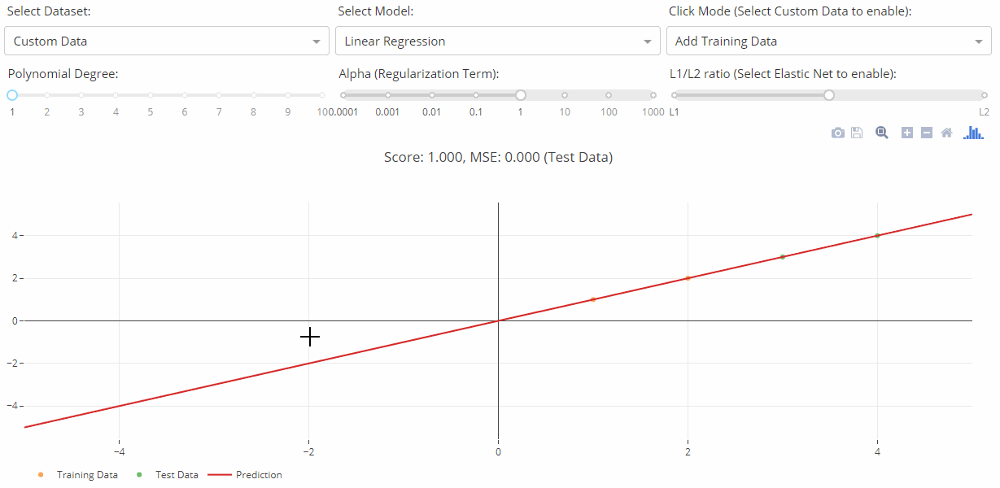

# Regression Explorer

This is a demo of the Dash interactive Python framework developed by [Plotly](https://plot.ly/).

Dash abstracts away all of the technologies and protocols required to build an interactive web-based application and is a simple and effective way to bind a user interface around your Python code. To learn more check out our [documentation](https://plot.ly/dash).

Try out the [demo app here](https://dash-regression.herokuapp.com/).



## Getting Started

### Using the demo
This demo lets you interactive explore different linear regression models. [Read more about Linear Models here](http://scikit-learn.org/stable/modules/linear_model.html#linear-model).

The **Select Dataset** dropdown lets you select different toy datasets with added noise. To add custom data, select the "Custom Data" option from the drodpwon and start clicking on the graph to add them. You can also choose to add training data, test data, or remove points using the Click Mode dropdown.

The **Select Model** dropdown lets you select different types of models. Linear Regression is the regular Least Square model, whereas the other ones are regularized models.

The **Polynomial Degree** slider lets you control how many polynomial degree do you want to use to fit your data. This will create a non-linear regression, at the risk of overfitting.

The **Alpha** Slider lets you control the regularization term, which penalizes large coefficient terms. This lets you control the variance and bias of your model.

**L1/L2 ratio** is for the Elastic Net model, and control the weight of each norm.

### Running the app locally

First create a virtual environment with conda or venv inside a temp folder, then activate it.

```
virtualenv dash-regression-venv

# Windows
dash-regression-venv\Scripts\activate
# Or Linux
source venv/bin/activate
```

Clone the git repo, then install the requirements with pip
```
git clone https://github.com/plotly/dash-regression.git
cd dash-regression
pip install -r requirements.txt
```

Run the app
```
python app.py
```

## About the app
### How does it work?
This app is fully written in Dash + scikit-learn. All the components are used as input parameters for scikit-learn or numpy functions, which then generates a model with respect to the parameters you changed. The model is then used to perform predictions that are displayed as a line plot. The combination of those two library lets you quickly write high-level, concise code.

## Built With
* [Dash](https://dash.plot.ly/) - Main server and interactive components
* [Plotly Python](https://plot.ly/python/) - Used to create the interactive plots
* [Scikit-Learn](http://scikit-learn.org/stable/documentation.html) - Run the regression algorithms and generate datasets

## Contributing
Please read [CONTRIBUTING.md](CONTRIBUTING.md) for details on our code of conduct, and the process for submitting pull requests to us.

## Authors
* **Xing Han Lu** - *Initial Work* - [@xhlulu](https://github.com/xhlulu)

See also the list of [contributors](https://github.com/your/project/contributors) who participated in this project.

## License
This project is licensed under the MIT License - see the [LICENSE.md](LICENSE.md) file for details

## Acknowledgments

## Screenshots
